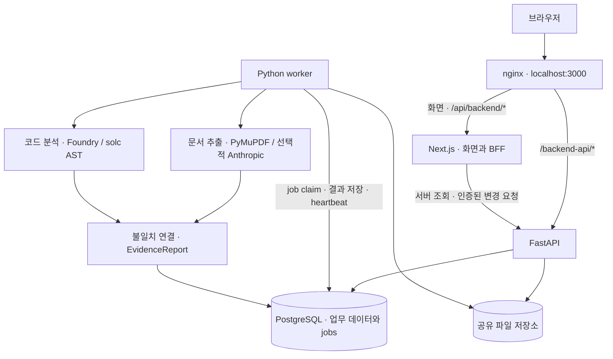

# RWA Guard

**발행 문서의 통제조건과 스마트컨트랙트 구현을 대조하고, 불일치의 근거를 연결하는 토큰증권 검증 웹서비스.**

2026 금융 AI Challenge에 제출하는 4인 팀 프로젝트다. 합성 상업용 부동산 수익증권을 대상으로 문서 원문, Solidity 코드, 검사 결과, 온체인 증거를 **Evidence Spine**에서 함께 확인한다.

현재 구현의 중심은 **자산 등록 → 문서 검토·확정 → 코드 검사 → 재검사 비교 → 증적 리포트**다. 온체인 시연은 명시적인 `REPLAY`를 사용하며, Kairos 실시간 수집과 가격 모델은 P1 확장 범위다.

## 현재 기능과 지원 범위

| 기능 | 현재 구현 |
|---|---|
| 자산 등록 | 합성 자산 정보, 발행 문서, Solidity 소스 또는 주소를 연결하는 단계별 등록 화면. 취약본·수정본 샘플 제공 |
| 문서 검토 | UTF-8 TXT와 텍스트 PDF에서 통제조건 6개를 추출하고 page/span 근거와 함께 검토·수정·확정 |
| 컨트랙트 검사 | Foundry/solc AST와 결정적 실행경로 분석으로 핵심 결함 3종 검사 |
| 근거 연결 | `ControlSpec → CodeFinding → MismatchFinding → EvidenceReport`, 문서 조항과 코드 파일·라인 연결 |
| 결과 비교 | Exploit Risk와 검증 제한 표시, 이전 검사 대비 `RESOLVED / REMAINS / NEW` 비교 |
| 리포트·검토 기록 | 저장된 리포트 조회, HTML/JSON 내보내기와 인쇄, 경보 상태·메모 및 감사 기록 |
| 실행 상태 | 문서·검사 job의 대기·실행·부분 실패·실패, worker heartbeat와 readiness 확인 |
| 데모 | 저장 가능한 합성 REPLAY bootstrap과 실제 업로드·worker 검사 경로를 각각 제공 |

공식 지원 범위는 **합성 상업용 부동산 수익증권 1종, Kaia Kairos(chain ID `1001`), 아래 룰 3종**이다.

| 룰 ID | 검사 대상 | 확정 결함 심각도 |
|---|---|---|
| `MINT_ACCESS_CONTROL_MISSING` | 발행 실행경로의 접근권한 검사 누락 | `CRITICAL` |
| `MINT_COLLATERAL_CAP_MISSING` | 발행 전 담보 확인 또는 최대 발행량 제한 누락 | `CRITICAL` |
| `ORACLE_VALIDATION_MISSING` | 오라클 값의 양수 여부·미래 시각·최대 경과시간 검증 누락 | `HIGH` |

문서에서 검토하는 6개 필드는 `max_supply`, `issuer_role`, `collateral_verified`, `oracle_max_age`, `price_band_breach`, `pauser_role`이다. 신규 검사는 이 6개를 모두 확정해야 시작된다. 코드 룰과 직접 연결되는 필드는 앞의 4개다. 현재 비교는 필수 가드의 존재와 실행경로를 대상으로 하며, 문서의 모든 수치·역할 값이 코드 설정과 같은지 또는 전체 문서 조건을 준수하는지까지 검증하지 않는다.

### 판정과 제한

- 확정 `CRITICAL / HIGH`에는 결정적 코드 근거와 문서 page/span이 필요하다. AI 단독 결과는 `NEEDS_REVIEW`이며 자동으로 `CONFIRMED`가 되지 않는다.
- 문서 추출은 합성 문서용 결정적 파서를 먼저 사용한다. 누락 필드는 설정에 따라 Anthropic 추출 후보로 보완하며, 키가 없거나 호출이 실패하면 제한을 기록한다. 이미지 PDF OCR은 지원하지 않는다.
- 분석기는 solc `0.8.24`로 컴파일 가능한 완전한 소스를 입력받는다. 주소만 등록한 경우 소스를 자동 수집하지 않으며, 소스·컴파일 실패는 `UNKNOWN`, 지원하지 않는 실행경로는 `NEEDS_REVIEW`로 남긴다. Slither는 선택적 교차 점검 도구다.
- 일반 worker 검사 결과에는 아직 온체인 증거가 연결되지 않는다. REPLAY 데모에는 fixture 버전을 표시하며 실제 receipt가 없는 데이터를 `LIVE`로 표시하지 않는다.
- Kairos 이벤트 polling, 라이브 가격 밴드·시뮬레이터, Supabase Realtime은 현재 기본 실행 경로에 포함되지 않는다. P1 장애가 P0 문서–코드 검사와 리포트 생성을 중단시켜서는 안 된다.
- 모든 입력과 fixture는 합성 데이터(`is_synthetic=true`)다. 실제 금융정보·개인정보를 저장하거나 자동 발행 승인·거래정지·실제 자금 이동을 수행하지 않는다.

분석기의 지원 문법과 판정 경계는 [보안 룰 명세](chain/SECURITY_RULES.md)를 참고한다.

## 시스템 구조



- **Web:** Next.js 16, React 19, TypeScript, React Aria Components, Tailwind CSS 4, TanStack Query, Shiki. 화면은 관제 홈, 자산 상세, 문서 검토, 컨트랙트 검사, 리포트로 구성된다.
- **API·worker:** Python 3.12+, FastAPI, Pydantic, SQLAlchemy. API가 PostgreSQL `jobs`에 작업을 기록하고 별도 worker가 `DOCUMENT_EXTRACT`와 `CONTRACT_SCAN`을 처리한다. 재시도·lock 회수·lease 검증을 사용하며 Celery/Redis는 사용하지 않는다.
- **데이터·배포:** 기본 Compose는 PostgreSQL 17, API, worker, Web, nginx의 5개 서비스다. API와 worker는 같은 Dockerfile과 파일 저장 volume을 사용한다. DB 초기화 SQL은 `infra/supabase/migrations/`에 있다.
- **계약:** Pydantic 모델에서 OpenAPI·JSON Schema와 Web TypeScript 타입을 생성한다. 현재 계약 버전은 [contracts/VERSION](contracts/VERSION)에 기록돼 있다.

브라우저의 읽기 요청은 같은 origin의 `/backend-api`를, 변경 요청은 `/api/backend` BFF를 사용한다. `BACKEND_OPERATOR_TOKEN`은 Next.js 서버에서만 전달한다. 운영자 잠금 해제 후 서명·만료가 있는 HttpOnly 세션으로 변경 작업을 수행하며, 현재 인증 범위는 구성된 단일 운영자다.

## 저장소 구조

```text
apps/web/
├─ src/app/                  Next.js 화면과 BFF/readiness 라우트
├─ src/components/           Evidence Spine, 문서 검토, 등록·리포트 UI
├─ src/lib/                  API adapter, 화면 상태, 세션·권한 경계
├─ src/types/generated/      OpenAPI에서 생성한 TypeScript 타입
├─ public/samples/           등록 화면용 합성 문서·취약/수정 코드 사본
└─ scripts/                  API 생성·drift 검사·client bundle 검사
services/backend/
├─ src/rwa_guard/
│  ├─ api/                   FastAPI 라우트·인증·오류 응답
│  ├─ domain/                Pydantic 런타임 계약
│  ├─ db/                    SQLAlchemy 모델과 repository
│  ├─ pipelines/             document, contract, mismatch, risk, report
│  ├─ worker/                job 실행기와 handler
│  └─ fixture_store.py       P0 fixture 경로·SHA-256 검증
├─ scripts/                  OpenAPI·JSON Schema export
└─ tests/                    API·pipeline·E2E·합성 평가셋
chain/
├─ src/fixtures/             기본·우회·상속 등 Solidity 검사 입력
├─ test/                     Foundry 테스트
└─ SECURITY_RULES.md         결정적 룰의 범위와 판정 계약
contracts/
├─ schemas/                 팀 검토용 JSON Schema
├─ generated/               Pydantic에서 생성한 Schema·OpenAPI
└─ examples/                공통 example payload
data/synthetic/             합성 자산·발행 문서·Replay·비교가격 데이터
fixtures/p0-manifest.json    배포에 필요한 fixture와 SHA-256 manifest
infra/                      Docker Compose, nginx, DB migrations
scripts/                    전체 검증 및 PowerShell 회귀 검사
docs/
├─ product/                 PRD, 화면과 상태 정의
├─ architecture/            기술·시각 방향, API·추출·job 설계
├─ project/                 소유권, 일정, 완료 정의
├─ submission/              제출 양식과 준비 문서
└─ competition/             공모전 참조 자료 · 수정 금지
```

트랙 A는 Web, B는 백엔드·문서 AI, C는 Solidity와 backend contract pipeline, D는 합성 데이터·온체인·배포를 맡는다. 자세한 경계는 [팀 소유권](docs/project/ownership.md)을 따른다.

## 빠른 시작: Docker Compose

Docker와 Compose v2를 준비한다. 아래 명령은 **저장소 루트의 PowerShell** 기준이다. 기본 합성 데모에는 AI API 키나 Kairos RPC가 필요하지 않다.

### 1. 환경 설정

기존 `.env`가 없다면 예시를 복사한다.

```powershell
Copy-Item .env.example .env
```

`.env`에 다음 값을 직접 설정한다.

| 변수 | 용도·조건 |
|---|---|
| `POSTGRES_PASSWORD` | 로컬 PostgreSQL 비밀번호. 연결 URL에 들어가므로 URL 예약문자를 피한 충분히 긴 무작위 값 사용 |
| `OPERATOR_TOKEN` | 서버 간 변경 요청을 인증하는 비밀값. Compose가 Web의 `BACKEND_OPERATOR_TOKEN`에도 동일하게 전달 |
| `OPERATOR_ID` | 감사 기록에 남길 단일 운영자 식별자 |
| `OPERATOR_ACCESS_CODE` | 화면에서 운영자 잠금 해제 시 입력. 20~256자, 영문 대·소문자·숫자·기호 포함 |
| `OPERATOR_SESSION_SECRET` | Web 세션 서명용 별도 비밀값. 32자 이상 |

비밀번호·토큰·서명키는 각각 새 값으로 설정하고 커밋하지 않는다. `.env`의 `$` 등은 Compose 변수 치환 대상이 될 수 있으므로 access code처럼 리터럴 보존이 필요한 값은 작은따옴표로 감싼다.

기본 origin은 `http://localhost:3000`이다. `ALLOW_INSECURE_LOCAL_SESSION=true`는 로컬 HTTP 세션에만 적용되는 예외다. 외부 배포에서는 HTTPS `PUBLIC_WEB_ORIGIN`과 `ALLOW_INSECURE_LOCAL_SESSION=false`를 사용한다. 프록시 헤더·세션 설정은 [인프라 안내](infra/README.md)를 참고한다.

### 2. 실행과 준비 상태 확인

```powershell
docker compose --env-file .env -f infra/docker-compose.yml config --quiet
docker compose --env-file .env -f infra/docker-compose.yml up --build
```

별도 PowerShell에서 확인한다.

```powershell
Invoke-RestMethod http://localhost:3000/backend-api/health/ready
Invoke-RestMethod http://localhost:3000/api/readiness
```

[로컬 웹서비스](http://localhost:3000)에 접속한다. host에 노출되는 포트는 nginx의 `3000`이며, Web·API·PostgreSQL은 Compose 내부에서 연결된다. API readiness는 인증 설정, fixture 무결성, DB, 최신 worker heartbeat를 확인한다. Web readiness는 서버 환경과 backend 인증·준비 상태까지 확인한다.

DB migration은 **빈 PostgreSQL volume의 최초 초기화 때만** 자동 적용된다. 기존 volume을 사용하는 경우 새 SQL을 순서대로 적용해야 하며, 재시작만으로 migration이 실행되지는 않는다. API와 worker의 P0 fixture는 이미지 빌드와 런타임에서 manifest로 검증한다.

기본 Compose는 AI 키를 worker에 전달하지 않는다. Anthropic 추출을 사용하려면 별도 Compose override 등으로 worker에 `ANTHROPIC_API_KEY`, `DOCUMENT_EXTRACTOR`, 필요 시 `ANTHROPIC_DOCUMENT_MODEL`을 전달한다. 루트 `.env`에 키를 적는 것만으로 활성화되지는 않는다.

### 3. 화면에서 재현하기

1. 운영자 잠금을 해제한다. 저장된 결과 조회와 달리 bootstrap·자산 등록·문서 확정·검사 등 변경 작업에는 운영자 세션이 필요하다.
2. **샘플 검증 시작**으로 저장된 합성 REPLAY 시나리오를 불러와 코드·문서 근거와 리포트를 확인한다. 이 bootstrap은 준비된 결과를 저장하는 경로이며 새 분석 job을 실행하지 않는다.
3. 실제 분석은 **신규 자산 등록**에서 샘플 자산, 발행조건서, 취약 또는 수정 컨트랙트를 선택해 시작한다.
4. 문서 추출 후 6개 통제조건의 원문 근거를 검토·확정하고 **컨트랙트 검사 시작**을 누른다.
5. 검사 결과와 Evidence Spine을 확인한다. 자산 상세에서 수정 Solidity 소스를 입력하고 **새 source로 재검사**를 실행하면 이전 검사를 기준으로 해결·잔존·신규 finding을 비교한다.
6. 리포트에서 JSON 다운로드·인쇄를 사용한다. HTML/JSON 원본은 `/backend-api/v1/reports/{report_id}/download?format=html` 또는 `format=json`으로 받는다.

## 개발과 검증

로컬 개발·검증 기준은 **Node.js 22, Python 3.12+, Foundry/forge, solc 0.8.24**다. 배포 이미지는 Foundry `v1.7.1`을 고정한다. 컨트랙트 분석은 offline 컴파일을 사용하므로 로컬에서는 먼저 `forge build`로 컴파일러를 준비한다.

저장소 루트에서 개발 의존성을 설치한다.

```powershell
python -m venv services/backend/.venv
& ./services/backend/.venv/Scripts/python.exe -m pip install -e './services/backend[dev]'
npm --prefix apps/web ci
Push-Location chain
forge build
Pop-Location
```

개별 프로세스의 실행 명령은 다음과 같다. API·worker는 설정된 DB와 migration, 공통 파일 저장소가 필요하다. Web 전체 흐름을 별도로 실행할 때도 `/backend-api`를 API로 전달하는 같은 origin 프록시를 구성해야 한다. `npm run dev`만으로 DB·API·worker가 시작되지는 않는다.

| 작업 디렉터리 | 명령 |
|---|---|
| `apps/web` | `npm run dev` |
| `services/backend` | 가상환경 활성화 후 `python -m uvicorn rwa_guard.api.main:app --reload` |
| `services/backend` | 같은 가상환경의 별도 터미널에서 `python -m rwa_guard.worker` |

모듈별 설정은 [Web](apps/web/README.md), [Backend](services/backend/README.md), [Solidity](chain/README.md), 각 모듈의 `.env.example`을 참고한다.

### 전체 검증

```powershell
powershell -ExecutionPolicy Bypass -File scripts/verify.ps1
```

전체 검증은 PowerShell 회귀 검사, JSON 파싱, backend pytest·Ruff·mypy, Web verify, Foundry fmt·build·test를 실행한다. 필수 도구나 의존성이 없으면 건너뛰지 않고 실패한다.

| 범위 | 작업 디렉터리 | 검증 명령 |
|---|---|---|
| Web | `apps/web` | `npm run verify` |
| Backend | `services/backend` | 가상환경에서 `python -m pytest`, `python -m ruff check .`, `python -m mypy` |
| Solidity | `chain` | `forge fmt --check`, `forge build`, `forge test` |

Web verify에는 생성 계약 drift 검사, 타입 검사, lint, Vitest, production build, client bundle 검사가 포함된다. GitHub Actions의 [CI 설정](.github/workflows/ci.yml)도 각 트랙을 검증한다.

### 공통 계약 변경

런타임 계약 원본은 [Pydantic 모델](services/backend/src/rwa_guard/domain/contracts.py)이다. backend 의존성과 Web 의존성을 설치한 뒤 생성물을 갱신한다.

```powershell
npm --prefix apps/web run gen:api
npm --prefix apps/web run check:api
```

`contracts/generated/`와 `apps/web/src/types/generated/`를 직접 편집하지 않는다. 모델·검토용 schema·example payload·생산자·소비자를 같은 변경에서 갱신하고, 생성물도 함께 커밋한다. 세부 절차는 [계약 안내](contracts/README.md)를 따른다.

### 평가 범위

합성 TXT 10개의 P0 6필드 추출 평가 기록은 [document-evaluation.json](services/backend/tests/golden/document-evaluation.json)에 있다. backend 디렉터리의 가상환경에서 `python -m pytest tests/test_document_golden.py`로 재현한다. 기록된 `exact_match_rate=1.0`은 이 결정적 합성 TXT 평가 범위에만 해당하며 AI·PDF·실데이터·대회 비공개 데이터의 정확도를 의미하지 않는다. 컨트랙트 평가의 범위와 한계는 [보안 검토 기록](chain/RED_TEAM_REVIEW.md)에 정리돼 있다. 미실측 지연·정확도·가용성을 완료 실적으로 표시하지 않는다.

## 프로젝트 문서와 제출 일정

| 문서 | 역할 |
|---|---|
| [제품 요구사항](docs/product/prd.md) | 기능 범위·우선순위·수용 기준의 단일 진실 |
| [기술 스택과 시각 방향](docs/architecture/stack-and-visual-direction.md) | 기술 경계와 Assurance Ledger UI 방향 |
| [화면과 상태](docs/product/screens-and-states.md) | 화면별 상태·행동 계약 |
| [팀 소유권](docs/project/ownership.md) · [완료 정의](docs/project/definition-of-done.md) | 역할·통합·검증 기준 |
| [제출 작업공간](docs/submission/README.md) | 제출 양식과 준비 안내 |
| [출처·라이선스 고지](NOTICE.md) · [합성 데이터 카탈로그](data/synthetic/README.md) | 외부 의존성과 데이터 출처 |

| 일정(KST) | 내용 |
|---|---|
| 2026-09-07 10:00 | 기획서·기능명세서·공개 웹서비스 URL 제출 |
| 2026-09-07 11:00 ~ 2026-09-11 23:59 | 제출 URL 접근 유지 기간 |
| 2026-10-08 23:59 | 발표심사 진출 시 발표자료·소스코드 제출 |

공식 일정·규칙의 원문은 `docs/competition/`을 참고한다. 기능 완료는 화면의 존재가 아니라 합성 fixture로 `ControlSpec → CodeFinding → MismatchFinding → EvidenceReport`를 재현하고 실패·제한·증거 모드를 정직하게 표시하는 것을 기준으로 한다.
